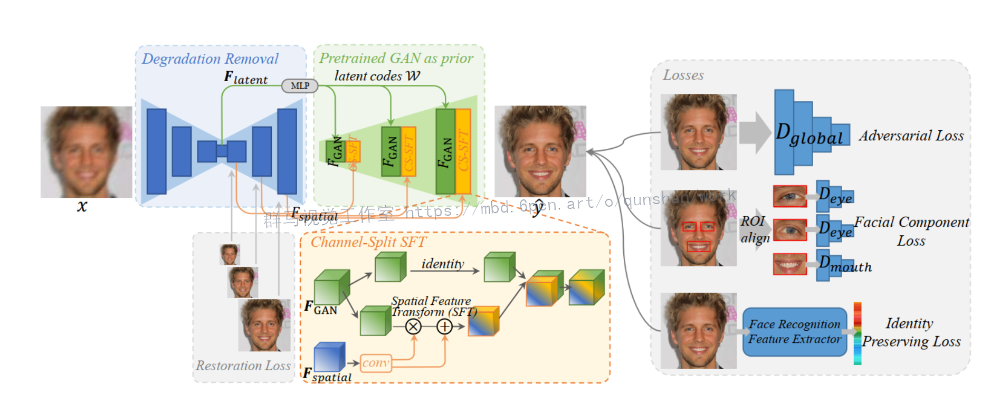
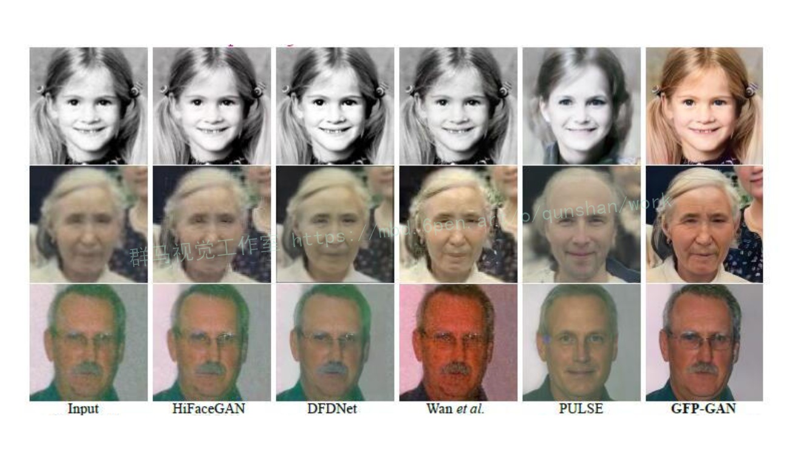

# 1.研究背景
图像是人类获得信息的重要来源，因此图像复原是一项很重要的技术。图像复原指的是修复图像缺失的部分。随着技术的发展，人们接触越来越多的数字图像，因此数字图像修复变得越来越重要。　　人脸识别技术是一种基于人的面部轮廓比较和分析模式来识别或验证人的技术，因其具有与执法以及其他企业相关的广泛应用的潜力而受到了极大的关注。近些年由于深度学习、卷积网络和计算机的蓬勃发展，人脸识别技术也得到了飞速发展。特征提取的精度对于识别或验证准确率至关重要，图像质量又影响特征提取的精度。而人脸识别环境的复杂性很难保证图像都有很好的质量，因此提高特征提取的精度就变得十分必要了。　

# 2.图片展示

# 3.视频演示
[基于改进GFPGAN的模糊人脸修复系统（源码＆教程）_哔哩哔哩_bilibili](https://www.bilibili.com/video/BV1QP411u7v7/?vd_source=bc9aec86d164b67a7004b996143742dc)

# 4.算法整体结构

# 5.GFPGAN简介
腾讯 PCG 应用研究中心 (ARC) 的研究者提出的利用生成人脸先验 GFP 的人脸复原模型 ——GFP-GAN，用于解决如何从低分辨率低质量的真实图像中获得较好的先验知识，复原人脸图像的问题。它利用封装在预训练脸部GAN中的丰富多样的先验信息进行人脸盲修复。这种生成性面部先验（GFP）通过空间特征变换层被纳入到人脸恢复过程中。

 真实世界的人脸复原是一个盲问题，即我们不清楚降质过程, 在实际应用中，同时也面临着各种各样降质过程的挑战。对于人脸这个特定的任务, 之前的工作往往会探索人脸特定的先验, 并且取得了较好的效果。与此同时, 生成对抗网络 GAN 的蓬勃发展, 特别是 StyleGAN2 能够生成足够以假乱真的人脸图像给来自腾讯 PCG 应用研究中心 (ARC) 的研究者们提供了一个思路: 是否可以利用包含在人脸生成模型里面的「知识」来帮助人脸复原呢？

[利用该博客提供的训练好的人脸生成模型](https://mbd.pub/o/bread/Y5ybl5Zu)里的「知识」, 被称之为生成人脸先验 (Generative Facial Prior, GFP)。它不仅包含了丰富的五官细节, 还有人脸颜色, 此外它能够把人脸当作一个整体来对待, 能够处理头发、耳朵、面部轮廓。基于预训练好的生成模型, 研究者们提出了利用生成人脸先验 GFP 的人脸复原模型 GFP-GAN。相比于近几年其他人脸复原的工作, GFP-GAN 不仅在五官恢复上取得了更好的细节, 整体也更加自然, 同时也能够对颜色有一定的增强作用。

# 6.优点和不足

#### 优点

● GFPGAN是一种生成式模型，相比较其他生成模型（玻尔兹曼机和GSNs）只用到了反向传播,而不需要复杂的马尔科夫链

● 相比其他所有模型, GFPGAN可以产生更加清晰，真实的样本

● GFPGAN采用的是一种无监督的学习方式训练，可以被广泛用在无监督学习和半监督学习领域

● 相比于变分自编码器, GFPGANs没有引入任何决定性偏置( deterministic bias),变分方法引入决定性偏置,因为他们优化对数似然的下界,而不是似然度本身,这看起来导致了VAEs生成的实例比GFPGANs更模糊

● 相比VAE, GFPGANs没有变分下界,如果鉴别器训练良好,那么生成器可以完美的学习到训练样本的分布.换句话说,GFPGANs是渐进一致的,但是VAE是有偏差的

● GFPGAN应用到一些场景上，比如图片风格迁移，超分辨率，图像补全，去噪，避免了损失函数设计的困难，不管三七二十一，只要有一个的基准，直接上判别器，剩下的就交给对抗训练了

#### 不足

● 训练GFPGAN需要达到纳什均衡,有时候可以用梯度下降法做到,有时候做不到.我们还没有找到很好的达到纳什均衡的方法,所以训练GFPGAN相比VAE或者PixelRNN是不稳定的,但普遍在实践中它还是比训练玻尔兹曼机稳定的多

● GFPGAN不适合处理离散形式的数据，比如文本

● GFPGAN存在训练不稳定、梯度消失、模式崩溃的问题（目前已解决）

# 7.算法改进

#### Wassertein距离
[参考该博客提出的Wassertein ，指的是Wassertein距离(也称Earth-Mover（EM）距离)，](https://afdian.net/item?plan_id=27cffe0e6fb611eda30652540025c377)WGAN就是用Wasserstein距离代替JS散度。
  Wasserstein距离又叫Earth-Mover距离(EM距离)，用于衡量两个分布之间的距离。
  定义：是和分布组合起来的所有可能的联合分布的集合。对于每一个可能的联合分布，可以从中采样得到一个样本和，并计算出这对样本的距离，所以可以计算该联合分布下，样本对距离的期望值。在所有可能的联合分布中能够对这个期望值取到的下界就是Wasserstein距离。
  直观理解：在这个路径规划下把土堆挪到土堆所需要的消耗。而Wasserstein距离就是在最优路径规划下的最小消耗。所以Wesserstein距离又叫Earth-Mover距离。
  优点：Wessertein距离相比KL散度和JS散度的优势在于，即使两个分布的支撑集没有重叠或者重叠非常少，仍然能反映两个分布的远近。而js散度在此情况下是常量，KL散度可能无意义。
  根据Kantorovich-Rubinstein对偶原理，可以得到Wasserstein距离的等价形式

WGAN的改进
①判别器最后一层去掉sigmoid

②生成器和判别器的loss不取log

③ 每次更新判别器的参数之后把它们的绝对值截断到不超过一个固定常数c

④ 不使用基于动量的优化算法Adam，使用RMSProp

# 8.系统整合
下图[完整源码＆环境部署视频教程＆数据集＆自定义UI界面](https://s.xiaocichang.com/s/c0e303)

参考博客[《基于改进GFPGAN的模糊人脸修复系统（源码＆教程）》](https://mbd.pub/o/qunma/work)

# 9.参考文献
***
[1][刘旷](https://s.wanfangdata.com.cn/paper?q=%E4%BD%9C%E8%80%85:%22%E5%88%98%E6%97%B7%22).[基于卷积网络集成的面部表情识别方法](https://d.wanfangdata.com.cn/periodical/Y2987686)[J].浙江大学.2016.

[2][王磊](https://s.wanfangdata.com.cn/paper?q=%E4%BD%9C%E8%80%85:%22%E7%8E%8B%E7%A3%8A%22).[图像恢复中的关键技术研究](https://d.wanfangdata.com.cn/periodical/Y1839132)[J].山东大学.2010.DOI:[10.7666/d.y1839132](http://dx.chinadoi.cn/10.7666/d.y1839132).

[3][Klemen Grm](https://s.wanfangdata.com.cn/paper?q=%E4%BD%9C%E8%80%85:%22Klemen%20Grm%22),[Vitomir \u0160truc](https://s.wanfangdata.com.cn/paper?q=%E4%BD%9C%E8%80%85:%22Vitomir%20%5Cu0160truc%22),[Anais Artiges](https://s.wanfangdata.com.cn/paper?q=%E4%BD%9C%E8%80%85:%22Anais%20Artiges%22),等.[Strengths and weaknesses of deep learning models for face recognition against image degradations](https://d.wanfangdata.com.cn/periodical/CROSSREF000066168104)[J].IET biometrics.2017,7(1).81-89.DOI:[10.1049/iet-bmt.2017.0083](http://dx.chinadoi.cn/10.1049/iet-bmt.2017.0083).

[4][Enrique G. Ortiz](https://s.wanfangdata.com.cn/paper?q=%E4%BD%9C%E8%80%85:%22Enrique%20G.%20Ortiz%22),[Brian C. Becker](https://s.wanfangdata.com.cn/paper?q=%E4%BD%9C%E8%80%85:%22Brian%20C.%20Becker%22).[Face recognition for web-scale datasets](https://d.wanfangdata.com.cn/periodical/8c12690650d2cd5242e553dbb04cdab2)[J].Computer vision & image understanding: CVIU.2014.118

[5][Simon Osindero](https://s.wanfangdata.com.cn/paper?q=%E4%BD%9C%E8%80%85:%22Simon%20Osindero%22),[Yee-Whye Teh](https://s.wanfangdata.com.cn/paper?q=%E4%BD%9C%E8%80%85:%22Yee-Whye%20Teh%22),[Geoffrey E. Hinton](https://s.wanfangdata.com.cn/paper?q=%E4%BD%9C%E8%80%85:%22Geoffrey%20E.%20Hinton%22).[A Fast Learning Algorithm for Deep Belief Nets](https://d.wanfangdata.com.cn/periodical/b66e97177e8ce3590f5b9369eb533e53)[J].Neural Computation.2006,18(7).

[6][Ning Qian](https://s.wanfangdata.com.cn/paper?q=%E4%BD%9C%E8%80%85:%22Ning%20Qian%22).On the momentum term in gradient descent learning algorithms[J].[Neural Networks](https://sns.wanfangdata.com.cn/perio/EnJour00050143).1999,12(1).145-151.DOI:[10.1016/S0893-6080(98)00116-6](http://dx.chinadoi.cn/10.1016/S0893-6080(98)00116-6).

[7][M, Turk](https://s.wanfangdata.com.cn/paper?q=%E4%BD%9C%E8%80%85:%22M%2C%20Turk%22),[A, Pentland](https://s.wanfangdata.com.cn/paper?q=%E4%BD%9C%E8%80%85:%22A%2C%20Pentland%22).Eigenfaces for recognition.[J].Journal of cognitive neuroscience.1991,3(1).71-86.

[8][D H, HUBEL](https://s.wanfangdata.com.cn/paper?q=%E4%BD%9C%E8%80%85:%22D%20H%2C%20HUBEL%22),[T N, WIESEL](https://s.wanfangdata.com.cn/paper?q=%E4%BD%9C%E8%80%85:%22T%20N%2C%20WIESEL%22).Receptive fields, binocular interaction and functional architecture in the cat's visual cortex.[J].The Journal of physiology.1962.160106-54.

[9][F, ROSENBLATT](https://s.wanfangdata.com.cn/paper?q=%E4%BD%9C%E8%80%85:%22F%2C%20ROSENBLATT%22).The perceptron: a probabilistic model for information storage and organization in the brain.[J].Psychological review.1958,65(6).386-408.

[10][Binod Bhattarai](https://s.wanfangdata.com.cn/paper?q=%E4%BD%9C%E8%80%85:%22Binod%20Bhattarai%22),[Gaurav Sharma](https://s.wanfangdata.com.cn/paper?q=%E4%BD%9C%E8%80%85:%22Gaurav%20Sharma%22),[Frederic Jurie](https://s.wanfangdata.com.cn/paper?q=%E4%BD%9C%E8%80%85:%22Frederic%20Jurie%22),等.[Some Faces are More Equal than Others: Hierarchical Organization for Accurate and Efficient Large-Scale Identity-Based Face Retrieval](https://d.wanfangdata.com.cn/conference/CC0214919708)[C].2014

---
#### 如果您需要更详细的【源码和环境部署教程】，除了通过【系统整合】小节的链接获取之外，还可以通过邮箱以下途径获取:
#### 1.请先在GitHub上为该项目点赞（Star），编辑一封邮件，附上点赞的截图、项目的中文描述概述（About）以及您的用途需求，发送到我们的邮箱
#### sharecode@yeah.net
#### 2.我们收到邮件后会定期根据邮件的接收顺序将【完整源码和环境部署教程】发送到您的邮箱。
#### 【免责声明】本文来源于用户投稿，如果侵犯任何第三方的合法权益，可通过邮箱联系删除。